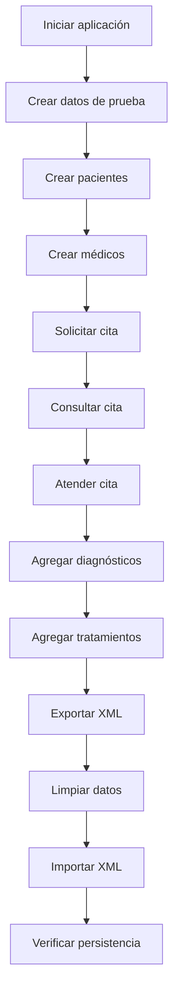

# 🏥 Hospital Manager POO

<div align="center">


**Sistema de gestión hospitalaria desarrollado en Java**
*Proyecto del curso de Programación Orientada a Objetos*

[Características](#-características) • [Estructura](#-estructura-del-proyecto) • [Instalación](#-cómo-ejecutar-el-proyecto) • [Uso](#-funcionalidades-del-sistema)

</div>

---

## 👥 Estudiantes

| Nombre | Rol |
|--------|-----|
| **Angie Alpizar** | Modelo de datos, Persistencia, Ventanas de citas |
| **Efram Matarrita** | Ventana principal, Gestión de pacientes y médicos, Diagramas UML |

---

## 📋 Descripción general

**Hospital Manager POO** es una aplicación de escritorio orientada a la gestión básica de información hospitalaria, desarrollada aplicando principios de Programación Orientada a Objetos.

### ✨ El sistema permite:

- ✅ Registrar pacientes y médicos
- ✅ Solicitar y gestionar citas médicas
- ✅ Consultar citas con filtros avanzados
- ✅ Atender citas con diagnósticos y tratamientos
- ✅ Persistencia mediante serialización binaria (`.DAT`)
- ✅ Importar y exportar datos usando XML
- ✅ Limpiar información almacenada

---

## 🛠️ Tecnologías utilizadas

<table>
<tr>
<td>

**Lenguaje**
- Java SE

</td>
<td>

**Interfaz Gráfica**
- Java Swing

</td>
<td>

**IDE**
- NetBeans

</td>
</tr>
<tr>
<td>

**Persistencia**
- Serialización de objetos
- Archivos `.DAT`

</td>
<td>

**Formato de intercambio**
- XML (DOM)

</td>
<td>

**Control de versiones**
- Git
- GitHub

</td>
</tr>
</table>

---

## 📁 Estructura del proyecto

```
Hospital-Manager/
│
├── 📂 src/
│   ├── 📦 Aplicacion/
│   │   ├── 🎯 Main.java                  # Punto de entrada
│   │   └── ⚙️ SistemaHospital.java       # Gestor central
│   │
│   ├── 📦 Conceptos/
│   │   ├── 👤 Paciente.java              # Modelo Paciente
│   │   ├── 👨‍⚕️ Medico.java                # Modelo Médico
│   │   └── 📋 Cita.java                  # Modelo Cita
│   │
│   ├── 📦 Presentacion/
│   │   ├── 🖥️ VentanaPrincipal.java      # Ventana principal
│   │   ├── 👥 VentanaPacientes.java      # CRUD Pacientes
│   │   ├── 🩺 VentanaMedicos.java        # CRUD Médicos
│   │   ├── ➕ VentanaSolicitarCita.java  # Crear cita
│   │   ├── 🔍 VentanaConsultarCitas.java # Consultar citas
│   │   └── ✅ VentanaAtenderCita.java    # Atender cita
│   │
│   └── 📦 Util/
│       ├── 💾 ArchivoBinario.java        # Serialización
│       └── 📄 ManejadorXML.java          # Import/Export XML
│
├── 📂 Data/                              # Archivos de persistencia
│   ├── PACIENTES.DAT
│   ├── MEDICOS.DAT
│   └── CITAS.DAT
│
├── 📂 Export/                            # Archivos de intercambio
│   ├── pacientes.xml
│   ├── medicos.xml
│   └── citas.xml
│
├── 📂 Diagramas/                         # Diagramas UML (Draw.io)
│   ├── diagrama_clases.drawio
│   ├── caso_uso_solicitar_cita.drawio
│   ├── caso_uso_consultar_cita.drawio
│   └── caso_uso_atender_cita.drawio
│
└── 📂 Imagenes/                          # Recursos gráficos
```

---

## 🎯 Paquetes principales

### 📦 Conceptos

Contiene las **clases del modelo de dominio**. Todas implementan `Serializable`.

<details>
<summary><b>👤 Paciente</b></summary>

**Atributos:**
- `String identificacion`
- `String nombre`
- `String telefono`
- `String email`

**Métodos principales:**
- Getters/Setters
- `toString()`

</details>

<details>
<summary><b>👨‍⚕️ Medico</b></summary>

**Atributos:**
- `String identificacion`
- `String nombre`
- `String telefono`
- `String puesto`

**Métodos principales:**
- Getters/Setters
- `toString()`

</details>

<details>
<summary><b>📋 Cita</b></summary>

**Atributos:**
- `int identificacion` (consecutivo)
- `Paciente paciente`
- `String fecha`
- `String observaciones`
- `Medico medico`
- `ArrayList<String> diagnosticos`
- `ArrayList<String> tratamientos`

**Métodos principales:**
- Getters/Setters
- `agregarDiagnostico(String)`
- `agregarTratamiento(String)`
- `toString()`

</details>

---

### 📦 Aplicacion

Contiene la **lógica de negocio**.

#### ⚙️ SistemaHospital

**Gestor central del sistema** que administra:

| Funcionalidad | Métodos |
|--------------|---------|
| **Pacientes** | `agregarPaciente()`, `modificarPaciente()`, `eliminarPaciente()`, `buscarPacientePorId()` |
| **Médicos** | `agregarMedico()`, `modificarMedico()`, `eliminarMedico()`, `buscarMedicoPorId()` |
| **Citas** | `agregarCita()`, `actualizarCita()`, `buscarCitaPorId()`, `generarConsecutivoCita()`, `buscarCitas()` |
| **Persistencia** | `cargarDatos()`, `guardarDatos()` |
| **XML** | `exportarDatos()`, `importarDatos()` |
| **Limpieza** | `limpiarDatos()` |

---

### 📦 Util

Contiene **clases de apoyo** para manejo de archivos.

#### 💾 ArchivoBinario

**Serialización binaria** de objetos Java.

```java
// Guardar
ArchivoBinario.guardar(lista, "PACIENTES.DAT");

// Leer
List<Paciente> pacientes = ArchivoBinario.leer("PACIENTES.DAT");
```

**Archivos generados:**
- `Data/PACIENTES.DAT`
- `Data/MEDICOS.DAT`
- `Data/CITAS.DAT`

#### 📄 ManejadorXML

**Import/Export** usando DOM (Java estándar).

```java
// Exportar
ManejadorXML.exportarPacientes(pacientes);
ManejadorXML.exportarMedicos(medicos);
ManejadorXML.exportarCitas(citas);

// Importar
ArrayList<Paciente> pacientes = ManejadorXML.importarPacientes();
ArrayList<Medico> medicos = ManejadorXML.importarMedicos();
ArrayList<Cita> citas = ManejadorXML.importarCitas(pacientes, medicos);
```

**Archivos generados:**
- `Export/pacientes.xml`
- `Export/medicos.xml`
- `Export/citas.xml`

---

### 📦 Presentacion

Contiene las **interfaces gráficas** desarrolladas con Java Swing.

| Ventana | Descripción |
|---------|-------------|
| 🖥️ **VentanaPrincipal** | Menú principal del sistema |
| 👥 **VentanaPacientes** | CRUD completo de pacientes |
| 🩺 **VentanaMedicos** | CRUD completo de médicos |
| ➕ **VentanaSolicitarCita** | Crear nueva cita |
| 🔍 **VentanaConsultarCitas** | Buscar y visualizar citas |
| ✅ **VentanaAtenderCita** | Completar información médica |

---

## 🚀 Funcionalidades del sistema

### 👥 Gestión de pacientes

<table>
<tr>
<td width="50%">

**Operaciones:**
- ✅ Crear pacientes
- ✅ Modificar pacientes
- ✅ Eliminar pacientes
- ✅ Visualizar en tabla
- ✅ Seleccionar para editar

</td>
<td width="50%">

**Campos:**
- Identificación
- Nombre
- Teléfono
- Email

</td>
</tr>
</table>

---

### 🩺 Gestión de médicos

<table>
<tr>
<td width="50%">

**Operaciones:**
- ✅ Crear médicos
- ✅ Modificar médicos
- ✅ Eliminar médicos
- ✅ Visualizar en tabla
- ✅ Seleccionar para editar

</td>
<td width="50%">

**Campos:**
- Identificación
- Nombre
- Teléfono
- Puesto

</td>
</tr>
</table>

---

### ➕ Solicitar cita

**Permite crear una nueva cita médica.**

**Proceso:**
1. Seleccionar paciente del combo
2. Ingresar fecha (`dd/MM/yyyy`)
3. Agregar observaciones (opcional)
4. Sistema genera ID consecutivo automático
5. Guardar cita

**Resultado:** Cita almacenada en `Data/CITAS.DAT`

---

### 🔍 Consultar citas

**Permite buscar citas existentes mediante filtros.**

**Filtros disponibles:**
- 🔍 Identificación del paciente
- 📞 Teléfono del paciente
- 📧 Email del paciente

**Lógica de búsqueda:**
- **Lógica AND:** Todos los filtros activos deben cumplirse
- **Sin filtros:** Muestra todas las citas

**Resultado:** Tabla con 10 columnas mostrando información completa

---

### ✅ Atender cita

**Permite completar la información médica de una cita.**

**Proceso:**
1. Seleccionar cita del combo
2. Sistema carga datos del paciente
3. Asignar médico (si no tiene)
4. Editar observaciones
5. Agregar diagnósticos (uno a uno)
6. Agregar tratamientos (uno a uno)
7. Guardar cambios

**Resultado:** Cita actualizada en `Data/CITAS.DAT`

---

## 🔄 Importar, Exportar y Limpiar

### 📤 Exportar

**Genera archivos XML** a partir de los objetos actuales del sistema.

```
Export/
├── pacientes.xml
├── medicos.xml
└── citas.xml
```

---

### 📥 Importar

**Carga información desde XML** y actualiza el sistema.

**Proceso:**
1. Lee archivos XML desde `Export/`
2. Elimina objetos actuales en memoria
3. Reconstruye objetos desde XML
4. Reescribe archivos `.DAT`

⚠️ **Advertencia:** Esta operación reemplaza todos los datos actuales.

---

### 🗑️ Limpiar

**Elimina todos los datos** del sistema.

**Efecto:**
- ❌ Vacía listas en memoria
- ❌ Vacía archivos `.DAT`
- ✅ **NO** elimina archivos XML

---

## 📋 Estructura XML

### Pacientes

```xml
<pacientes>
  <paciente id="101">
    <nombre>Ana Mora</nombre>
    <telefono>8888-1111</telefono>
    <email>ana@email.com</email>
  </paciente>
</pacientes>
```

### Médicos

```xml
<medicos>
  <medico id="M01">
    <nombre>Dr. Carlos Pérez</nombre>
    <telefono>2222-1111</telefono>
    <puesto>Médico general</puesto>
  </medico>
</medicos>
```

### Citas

```xml
<citas>
  <cita id="1">
    <paciente_id>101</paciente_id>
    <fecha>17/06/2024</fecha>
    <medico_id>M01</medico_id>
    <observaciones>Consulta general</observaciones>
    <diagnosticos>
      <diagnostico>Presión arterial normal</diagnostico>
    </diagnosticos>
    <tratamientos>
      <tratamiento>Control anual</tratamiento>
    </tratamientos>
  </cita>
</citas>
```

---

## 🚀 Cómo ejecutar el proyecto

### Requisitos previos

- ☕ Java JDK 8 o superior
- 🛠️ NetBeans IDE

### Pasos

1. **Clonar el repositorio**
   ```bash
   git clone https://github.com/tu-usuario/hospital-manager-poo.git
   ```

2. **Abrir NetBeans**

3. **Abrir proyecto existente**
   - File → Open Project
   - Seleccionar carpeta `Hospital-Manager/`

4. **Verificar clase principal**
   - Click derecho en el proyecto → Properties
   - Run → Main Class: `Aplicacion.Main`

5. **Ejecutar**
   - Presionar `F6` o click en ▶️ Run Project

---

## 🧪 Flujo de prueba recomendado

Para verificar el funcionamiento completo:



### Paso a paso

1. ✅ **Crear pacientes** → VentanaPacientes
2. ✅ **Crear médicos** → VentanaMedicos
3. ✅ **Solicitar cita** → VentanaSolicitarCita
4. ✅ **Consultar cita** → VentanaConsultarCitas
5. ✅ **Atender cita** → VentanaAtenderCita
6. ✅ **Agregar diagnóstico** → "Hipertensión"
7. ✅ **Agregar tratamiento** → "Enalapril 10mg"
8. ✅ **Guardar cambios** → Persistencia en `.DAT`
9. ✅ **Cerrar y reabrir** → Verificar datos conservados
10. ✅ **Exportar XML** → Archivos en `Export/`
11. ✅ **Limpiar datos** → Sistema vacío
12. ✅ **Importar XML** → Datos restaurados

---

## 📊 Diagramas UML

El proyecto incluye diagramas desarrollados en **Draw.io**:

| Diagrama | Ubicación |
|----------|-----------|
| 📐 **Diagrama de clases** | `Diagramas/diagrama_clases.drawio` |
| 📝 **Caso de uso: Solicitar cita** | `Diagramas/caso_uso_solicitar_cita.drawio` |
| 🔍 **Caso de uso: Consultar cita** | `Diagramas/caso_uso_consultar_cita.drawio` |
| ✅ **Caso de uso: Atender cita** | `Diagramas/caso_uso_atender_cita.drawio` |

---

## 👨‍💻 Organización del trabajo

### Angie Alpizar

**Responsabilidades:**
- 📦 Clases base del modelo (`Paciente`, `Medico`, `Cita`)
- 💾 Serialización en archivos `.DAT` (`ArchivoBinario`)
- ⚙️ Gestor central del sistema (`SistemaHospital`)
- 📄 Manejo XML (`ManejadorXML`)
- 🔄 Operaciones importar/exportar/limpiar
- 🖥️ Ventanas de citas:
  - `VentanaSolicitarCita`
  - `VentanaConsultarCitas`
  - `VentanaAtenderCita`
- 🧪 Pruebas de flujo de citas, DAT y XML

---

### Efram Matarrita

**Responsabilidades:**
- 🖥️ Ventana principal (`VentanaPrincipal`)
- 👥 Ventana de pacientes (`VentanaPacientes`)
- 🩺 Ventana de médicos (`VentanaMedicos`)
- 🎨 Integración visual del sistema
- 🖼️ Iconos e imágenes
- 📊 Diagramas UML (Draw.io)
- ✅ Pruebas finales de integración

---

## ⚙️ Consideraciones técnicas

| Aspecto | Detalle |
|---------|---------|
| **Paradigma** | Programación Orientada a Objetos |
| **Persistencia primaria** | Archivos binarios `.DAT` (Serialización) |
| **Formato de intercambio** | XML (solo import/export) |
| **Librerías externas** | ❌ Ninguna (solo Java estándar) |
| **Interfaz gráfica** | Java Swing |
| **IDE recomendado** | NetBeans |
| **Arquitectura** | Separación por capas (Conceptos, Aplicacion, Presentacion, Util) |

---

## 📈 Estado del proyecto

```
✅ Modelo de datos         → Completado
✅ Persistencia DAT        → Completado
✅ Manejo XML              → Completado
✅ Ventanas de citas       → Completado
✅ Ventanas de pacientes   → Completado
✅ Ventanas de médicos     → Completado
✅ Integración general     → Completado
✅ Pruebas finales         → Completado
✅ Documentación           → Completado
```

---

## 📝 Licencia

Este es un **proyecto académico** desarrollado con fines educativos para el curso de Programación Orientada a Objetos.

---

## 🤝 Contribuciones

Este proyecto fue desarrollado como parte de un curso universitario. Las contribuciones están cerradas.

---

<div align="center">

**Desarrollado con ❤️ por Angie Alpizar y Efram Matarrita**

*Tecnológico de Costa Rica - 2024*

---

⭐ Si este proyecto te fue útil, considera darle una estrella

</div>
